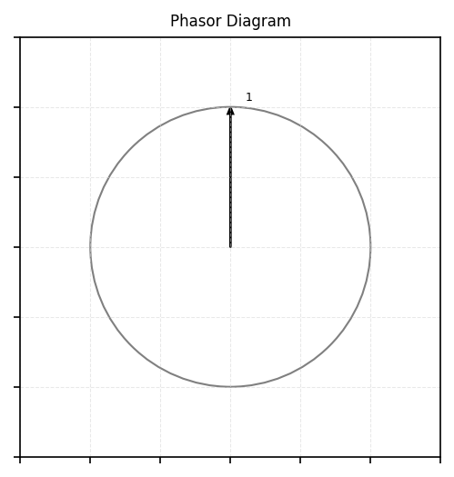

# Phasor diagram - 12-Slot/ 10-Pole/ Double-layer/ Concentrated winding

**Inputs**:
- `Q` (int): Total number of slots in the motor (e.g., 12).
- `p` (int): Total number of poles in the motor (e.g., 10).
- `m` (int): Number of phases in the motor (e.g., 3 for a three-phase motor).

**What you calculate**:
- `t = gcd(Q, PP)`
- `Qp = Q / t`, `phasors_per_layer = int(Qp)`
- `alpha_u`

**Phasor assignment**:
- Explanation: Phasors start at 90 degrees and proceed clockwise by subtracting `alpha_u`. 
- Phase Order: Defined as: `["phase -U", "phase +W", "phase -V", "phase +U", "phase -W", "phase +V"]`
    - Assignment: CW or CCW

# Distribution factor - 12-Slot/ 10-Pole/ Double-layer/ Concentrated winding

The distribution factor for the fundamental component is given as geometric sum/ sum of absolute values

# Explanation of Calculations in the `plot_phasor_diagram` Function

The `plot_phasor_diagram` function generates a phasor diagram for an electric motor, visualizing the spatial distribution of phasors (representing coil currents) in a stator with specified slots, poles, and phases. It also produces animation frames to show the step-by-step construction of the diagram. This document explains the key calculations performed in the function, focusing on the mathematical and logical steps used to compute phasor positions, angles, layers, and phase assignments.

## Function Overview

**Purpose**: The function calculates the angular positions and phase assignments of phasors for a motor's stator slots, plots them in a circular diagram (with multiple layers if needed), and generates animation frames for a .gif. The phasors are sorted by layer and angle, and each is labeled with a number and phase designation (e.g., "1 (-U)").

**Inputs**:
- `Q` (int): Total number of slots in the motor (e.g., 12).
- `p` (int): Total number of poles in the motor (e.g., 10).
- `m` (int): Number of phases in the motor (e.g., 3 for a three-phase motor).

**Outputs**:
- A list of `[phasor_number, normalized_angle, phase, layer]` quadruples, where:
  - `phasor_number`: Integer from 1 to `Q`, identifying each phasor.
  - `normalized_angle`: Angle in degrees [0, 360), representing the phasor's position.
  - `phase`: Phase designation (e.g., "phase -U", "phase +W").
  - `layer`: Layer index (0 to `t-1`, where `t` is the number of layers).
- A list of image arrays (frames) for creating an animated .gif (not covered in calculations).

## Key Calculations

The function performs several calculations to determine phasor positions, layers, and phase assignments. Below, each step is explained in detail.

### 1. Derived Parameters

The function calculates several parameters based on the inputs `Q`, `p`, and `m` to configure the phasor diagram:

- **Pole-Pairs (`PP`)**:
  - Formula: `PP = int(p / 2)`
  - Explanation: The number of pole-pairs is half the total number of poles, as each pole-pair consists of a north and south pole. For `p=10`, `PP=5`.
  - Purpose: Used in angle calculations and layer determination.

- **Number of Layers (`t`)**:
  - Formula: `t = gcd(Q, PP)`
  - Explanation: The number of layers is the greatest common divisor (GCD) of the number of slots (`Q`) and pole-pairs (`PP`). This determines how phasors are grouped into concentric layers in the diagram. For `Q=12` and `PP=5`, `t=gcd(12, 5)=1` (single layer). If `Q=12` and `p=4` (`PP=2`), `t=gcd(12, 2)=2` (two layers).
  - Purpose: Defines the number of radial layers for plotting phasors.

- **Phasors per Layer (`Qp` and `phasors_per_layer`)**:
  - Formula: `Qp = Q / t`, `phasors_per_layer = int(Qp)`
  - Explanation: The number of phasors per layer is the total number of slots divided by the number of layers. For `Q=12` and `t=1`, `Qp=12/1=12`, so `phasors_per_layer=12`. For `Q=12` and `t=2`, `Qp=12/2=6`, so `phasors_per_layer=6`.
  - Purpose: Determines how many phasors are plotted in each layer.

- **Slots per Pole per Phase (`q`)**:
  - Formula: `q = Fraction(Q, p * m)`
  - Explanation: The number of slots per pole per phase is calculated as a fraction, where `Q` is the total slots, `p` is the number of poles, and `m` is the number of phases. For `Q=12`, `p=10`, `m=3`, `q=12/(10*3)=12/30=2/5`. The numerator (`z=q.numerator=2`) and denominator (`n=q.denominator=5`) are extracted.
  - Purpose: Used to determine the winding type (integral or fractional) and angular displacements.

### 2. Angular Displacements

The function calculates the angular spacing between phasors, which depends on whether the motor has an integral or fractional slot winding:

- **Base Angle (`alpha_z`)**:
  - Formula: `alpha_z = 360 / Qp` (for fractional slot designs) or `alpha_z = alpha_u` (for integral slot designs).
  - Explanation: This is the base angular spacing in degrees. For fractional slot designs (`t != PP`), it’s the angle between phasors within a layer. For `Qp=12`, `alpha_z=360/12=30` degrees.

- **Phasor Angle (`alpha_u`)**:
  - Formula:
    - If `t == PP` (integral slot winding): `alpha_u = 360 * PP / Q`
    - If `t != PP` (fractional slot winding):
      - If `n` (denominator of `q`) is odd: `alpha_u = n * alpha_z`
      - If `n` is even: `alpha_u = n / 2 * alpha_z`
  - Explanation:
    - For integral slot windings (`t == PP`), the angle between consecutive phasors is based on the pole-pairs and slots. For `PP=5`, `Q=12`, `alpha_u=360*5/12=150` degrees.
    - For fractional slot windings, the angle depends on the winding type:
      - Odd `n` (first-grade winding): `alpha_u` is the denominator times the base angle. For `n=5`, `alpha_z=30`, `alpha_u=5*30=150` degrees.
      - Even `n` (second-grade winding): `alpha_u` is half the denominator times the base angle. For `n=4`, `alpha_z=30`, `alpha_u=(4/2)*30=60` degrees.
  - Purpose: Determines the angular step between consecutive phasors when plotting.

- **Current Angle**:
  - Initial Value: `current_angle = 90`
  - Update: `current_angle -= alpha_u` for each phasor.
  - Normalized Angle: `normalized_angle = current_angle % 360`
  - Explanation: Phasors start at 90 degrees (top of the plot, positive y-axis) and proceed clockwise by subtracting `alpha_u`. The angle is normalized to [0, 360) to avoid negative or large values. For `alpha_u=150`, the angles might be 90, -60 (normalized to 300), 150, etc.
  - Purpose: Positions each phasor on the diagram.

### 3. Layer Radii

- **Formula**: `radii = [1 + 0.5 * i for i in range(t)]`
- Explanation: Each layer is plotted at a different radius to avoid overlap. The first layer (index 0) has radius 1, the second (index 1) has radius 1.5, and so on. For `t=1`, `radii=[1]`; for `t=2`, `radii=[1, 1.5]`.
- Purpose: Defines the radial distance for plotting phasors in each layer, ensuring visual separation.

### 4. Phasor Plotting and Frame Generation

While not the focus of calculations, the plotting logic involves:
- **Shaft Scale**: `shaft_scale = 1 - (head_length / radius)`, where `head_length=0.05`. This adjusts the arrow length so the tip (including the arrowhead) lies on the circle of the given radius.
- **Coordinates**: For each phasor, the x and y coordinates are calculated as:
  - `angle_rad = np.deg2rad(current_angle)`
  - `x = radius * shaft_scale * np.cos(angle_rad)`
  - `y = radius * shaft_scale * np.sin(angle_rad)`
- **Text Position**: Labels are placed slightly beyond the arrow tip using:
  - `text_offset = 1.08 * radius`
  - `text_x = text_offset * np.cos(angle_rad - text_angle_offset / 180 * np.pi)`
  - `text_y = text_offset * np.sin(angle_rad - text_angle_offset / 180 * np.pi)`
  - where `text_angle_offset=7` degrees avoids overlap.
- **Frames**: Each phasor addition generates a frame, with the final frame including phase labels.

### 5. Phasor Sorting

Phasors are sorted to ensure consistent ordering in the output array:
- **Grouping by Layer**:
  - Phasors are grouped into `t` lists based on their layer index.
  - For each phasor `[number, angle, layer, text_coords]`, it’s added to `layered_phasors[layer]`.
- **Sorting by Angle**:
  - Within each layer, phasors are sorted by their normalized angle, starting at 90 degrees.
  - Sorting key: `(x[1] - 90) % 360`, where `x[1]` is the normalized angle. This maps 90° to 0, 91° to 1, ..., 89° to 359, ensuring phasors are ordered clockwise from the top.
- **Combining Layers**:
  - The sorted phasors are concatenated: layer 0, then layer 1, etc., into `sorted_phasors`.
- **Purpose**: Ensures the output array is ordered by layer and angle, matching the visual plot.

### 6. Phase Assignments

Phase designations are assigned to phasors based on the motor’s configuration:
- **Elements per Phase**:
  - Formula: `elements_per_phase = int(Q / t / m / 2)`
  - Explanation: Each phase (e.g., U, V, W) has positive and negative phasors (e.g., +U, -U). The number of phasors per phase direction is `Q/(t*m*2)`. For `Q=12`, `t=1`, `m=3`, `elements_per_phase=12/(1*3*2)=2`.
- **Phase Order**:
  - Defined as: `["phase -U", "phase +W", "phase -V", "phase +U", "phase -W", "phase +V"]`
  - This cyclic order ensures balanced phase distribution.
- **Assignment**:
  - Generate a list `phase_assignments` by repeating each phase `elements_per_phase` times until `Q` phasors are assigned.
  - For `Q=12`, `elements_per_phase=2`, the assignments might be: `[-U, -U, +W, +W, -V, -V, +U, +U, -W, -W, +V, +V]`.
- **Mapping**:
  - A dictionary `phasor_to_phase` maps each phasor number to its phase based on the sorted order.
- **Purpose**: Assigns each phasor a phase for labeling (e.g., “1 (-U)”) and for use in phasor sum calculations.

### 7. Final Output Array

- **Construction**:
  - Formula: `phasor_angles_with_phase = [[p[0], p[1], phase_assignments[i], p[2]] for i, p in enumerate(sorted_phasors)]`
  - Explanation: Combines the sorted phasor data (`p[0]=number`, `p[1]=normalized_angle`, `p[2]=layer`) with the corresponding phase from `phase_assignments`.
- **Format**: List of `[phasor_number, normalized_angle, phase, layer]` quadruples.
- **Example**: For `Q=12`, `p=10`, `m=3`, the output might include entries like `[1, 90, "phase -U", 0]`, `[2, 300, "phase -U", 0]`, etc., sorted by layer and angle.
- **Purpose**: Provides a structured representation of all phasors for further processing (e.g., phasor sum plots) and matches the plotted diagram.

## Example Calculation Walkthrough

For `Q=12`, `p=10`, `m=3`:
- **Derived Parameters**:
  - `PP = 10/2 = 5`
  - `t = gcd(12, 5) = 1`
  - `Qp = 12/1 = 12`, `phasors_per_layer = 12`
  - `q = 12/(10*3) = 12/30 = 2/5`, `z=2`, `n=5`
- **Angular Displacements**:
  - Since `t=1 != PP=5`, use fractional slot calculation.
  - `alpha_z = 360/12 = 30` degrees.
  - `n=5` (odd), so `alpha_u = 5 * 30 = 150` degrees.
  - Start at `current_angle=90`, then 90-150=-60 (normalized to 300), 300-150=150, etc.
- **Layer Radii**: `t=1`, so `radii=[1]`.
- **Sorting**:
  - Single layer (`t=1`), sort 12 phasors by angle from 90° clockwise.
  - Angles (e.g., 90, 300, 150, ...) are sorted as (90-90)%360=0, (300-90)%360=210, (150-90)%360=60, etc.
- **Phase Assignments**:
  - `elements_per_phase = 12/(1*3*2) = 2`
  - Assign: 2 *-U, 2 *+W, 2 *-V, 2 *+U, 2 *-W, 2 *+V.
- **Output**: A list of 12 quadruples, sorted by angle within the single layer, with phase labels.

## Notes
- **Winding Type**: The function handles both integral (`t == PP`) and fractional (`t != PP`) slot windings, affecting angle calculations.
- **Layering**: Multiple layers (`t > 1`) are rare for typical inputs but are supported for complex motor designs.
- **Animation**: The calculations support frame generation, but the plotting logic (e.g., arrow coordinates, text positions) is secondary to the core phasor computations.
- **Applications**: The output array is used for subsequent phasor sum calculations, as in `generate_phasor_list_for_X_phase` and `plot_multiple_phasor_sum`.

This document provides a comprehensive overview of the calculations in `plot_phasor_diagram`, making the function’s logic accessible to those analyzing electric motor phasor diagrams.

**Citation: DESIGN OF ROTATING ELECTRICAL MACHINES - Juha Pyrhonen**