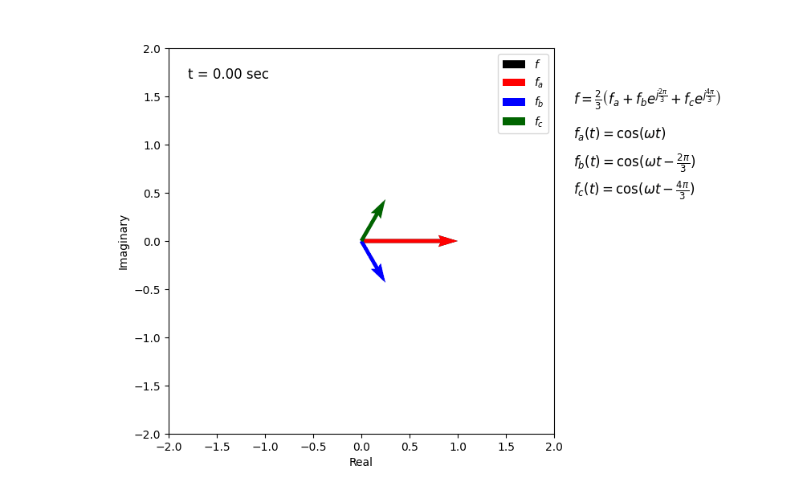

# Mathematical Concepts

# Phasor & Space Vector Definition

A **phasor** is a **complex number** that represents the **amplitude** and **phase angle** of a sinusoidal function (like voltage $v(t)$ or current $v(t)$) at a **single, specific frequency**. The phasor $\mathbf{V}$ corresponding to $v(t) = V_m \cos(\omega t + \phi)$ is:

$$
\mathbf{V} = V_m e^{j\phi}
$$

A **space vector** is a single **rotating vector** in a 2D complex plane. It represents the combination of 3 time quantities & spatial quantities (voltages or currents that add to zero and complex spatial operators).
The **voltage space vector**, denoted as $\mathbf{v}_s(t)$, is defined by combining $v_a(t), v_b(t),$ and $v_c(t)$ phase voltages with complex spatial operators:

$$
\mathbf{v}_s(t) = \frac{2}{3} \left[ v_a(t) + v_b(t)e^{j 2\pi/3} + v_c(t)e^{j 4\pi/3} \right]
$$

NOTES:
* Space vector rotates in CCW direction
* $v_a(t) + v_b(t) + v_c(t) = 0$
* $2/3$ represents the amplitude-invariant Clarke transformation scaling
* $V_m$ is the **peak amplitude**.
* $\omega$ is the **angular frequency** (in radians per second, $\omega = 2\pi f$).
* $\phi$ is the **phase angle** (in radians or degrees), indicating the signal's shift relative to a reference (often a pure cosine wave).
* $t$ is **time**.
* $1 + e^{j 2\pi/3} + e^{j 4\pi/3} = 0$
* $e^{j 2\pi/3}$ is the complex spatial operator representing a $120^\circ$ rotation
* $e^{j 2\pi/3} = \cos(2\pi/3) + j\sin(2\pi/3) = -\frac{1}{2} + j\frac{\sqrt{3}}{2}$
* $e^{j 4\pi/3} = \cos(4\pi/3) + j\sin(4\pi/3) = -\frac{1}{2} - j\frac{\sqrt{3}}{2}$

# Here's a more detailed breakdown:

## 1. Representation of Sinusoids
In the context of physics and engineering, particularly electrical engineering and wave analysis:

Sinusoidal signals (like voltage $v(t)$ or current $i(t)$) vary with time, typically described by equations like:

$$
v(t) = V_m \cos(\omega t + \phi)
$$

Where:
* $V_m$ is the **peak amplitude**.
* $\omega$ is the **angular frequency** (in radians per second, $\omega = 2\pi f$).
* $\phi$ is the **phase angle** (in radians or degrees), indicating the signal's shift relative to a reference (often a pure cosine wave).
* $t$ is **time**.

## 2. Complex Number Representation

Phasors leverage Euler's formula ($e^{j\theta} = \cos(\theta) + j\sin(\theta)$) to simplify this. A sinusoid $A \cos(\omega t + \phi)$ can be thought of as the real part ($\text{Re}$) of a complex exponential:

$$
A \cos(\omega t + \phi) = \text{Re}\{A e^{j(\omega t + \phi)}\} = \text{Re}\{A e^{j\phi} e^{j\omega t}\}
$$

## 3. The Phasor Itself

The phasor representation, often denoted by a bold letter (e.g., $\mathbf{V}$) or a letter with a tilde ($\tilde{V}$), captures the constant parts of this complex representation: the amplitude and the phase.

The phasor $\mathbf{V}$ corresponding to $v(t) = V_m \cos(\omega t + \phi)$ is:

$$
\mathbf{V} = V_m e^{j\phi}
$$

This can also be expressed in:
* **Polar form:** $\mathbf{V} = V_m \angle \phi$
* **Rectangular form:** $\mathbf{V} = V_m (\cos \phi + j \sin \phi) = A + jB$, where $A = V_m \cos \phi$ and $B = V_m \sin \phi$. (Note: In electrical engineering, $j$ is used for the imaginary unit $\sqrt{-1}$ to avoid confusion with current, $i$).

## 4. Key Points

* **Frequency Suppression:** The phasor contains *only* amplitude and phase information. The frequency ($\omega$) is implicitly understood to be constant for all phasors in a given circuit analysis and is not explicitly part of the phasor itself.
* **Transformation:** Phasors transform problems involving sinusoidal steady-state analysis from differential equations in the time domain into algebraic equations in the complex frequency domain. This greatly simplifies calculations involving resistors, capacitors, and inductors in AC circuits.
* **RMS vs. Peak:** Sometimes, phasors represent the **RMS (Root Mean Square)** amplitude instead of the peak amplitude ($V_{rms} = V_m / \sqrt{2}$). It's important to know which convention is being used. In many engineering contexts, RMS is the default.

In essence, a phasor is a convenient mathematical shorthand, a "snapshot" representing the magnitude and starting phase of a sinusoidal signal of a known, constant frequency $\omega$.

# Space Vector Definition (Balanced Three-Phase System)

In the context of three-phase electrical systems (like AC motors and power grids), a **space vector** is a mathematical construct used to represent the instantaneous state of the three separate phase quantities (voltages or currents) as a single rotating vector in a two-dimensional complex plane. This transformation simplifies the analysis and control of three-phase systems.

## 1. Balanced Three-Phase Voltages

Consider a balanced three-phase voltage system where the three phase voltages have equal peak amplitudes ($V_m$), the same angular frequency ($\omega$), are phase-shifted by $120^\circ$ ($2\pi/3$ radians) relative to each other, and sum to zero at any instant in time.

We can define the instantaneous phase voltages as:

* Phase A: $v_a(t) = V_m \cos(\omega t)$
* Phase B: $v_b(t) = V_m \cos(\omega t - 2\pi/3)$
* Phase C: $v_c(t) = V_m \cos(\omega t - 4\pi/3)$

For a balanced system, it holds that:

$$
v_a(t) + v_b(t) + v_c(t) = 0
$$

## 2. Space Vector Definition

The voltage space vector, denoted as $\mathbf{v}_s(t)$, is defined by combining the three instantaneous phase voltages using complex spatial operators. A common definition (using the amplitude-invariant Clarke transformation scaling) is:

$$
\mathbf{v}_s(t) = \frac{2}{3} \left[ v_a(t) + v_b(t) a + v_c(t) a^2 \right]
$$

Where $a$ is the complex spatial operator representing a $120^\circ$ rotation:

$$
a = e^{j 2\pi/3} = \cos(2\pi/3) + j\sin(2\pi/3) = -\frac{1}{2} + j\frac{\sqrt{3}}{2}
$$

And $a^2$ represents a $240^\circ$ rotation:

$$
a^2 = e^{j 4\pi/3} = \cos(4\pi/3) + j\sin(4\pi/3) = -\frac{1}{2} - j\frac{\sqrt{3}}{2}
$$

Note: $1 + a + a^2 = 0$.

## 3. Resulting Space Vector

When the expressions for the balanced instantaneous phase voltages $v_a(t)$, $v_b(t)$, and $v_c(t)$ are substituted into the space vector definition, the result simplifies significantly:

$$
\mathbf{v}_s(t) = V_m e^{j\omega t}
$$

This means the space vector $\mathbf{v}_s(t)$ for a balanced three-phase system is a **vector** in the complex plane with:
* **Constant Magnitude:** Equal to the peak phase voltage, $V_m$.
* **Rotation:** It rotates counter-clockwise at the angular frequency $\omega$.

## 4. Relation to Phasors

* A **phasor** (like $\mathbf{V}_a = V_m \angle 0$) represents the amplitude ($V_m$) and *initial* phase angle ($\phi=0$ for phase A) of a *single* sinusoidal waveform. It's a static complex number for a given frequency.
* The **space vector** $\mathbf{v}_s(t)$ represents the *instantaneous combined effect* of all *three* phase voltages. It's a dynamic quantity – a vector rotating in the complex plane over time. Its magnitude ($V_m$) relates directly to the peak amplitude of the individual phase voltages.
